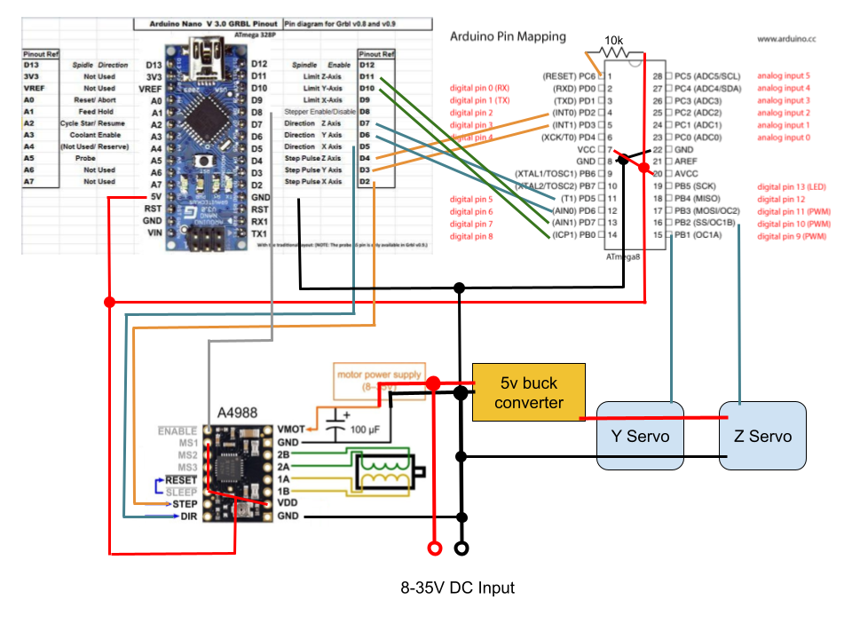
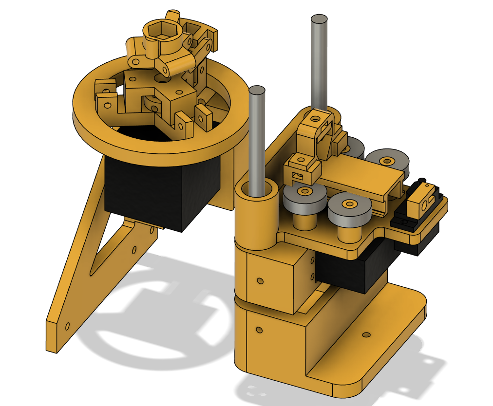
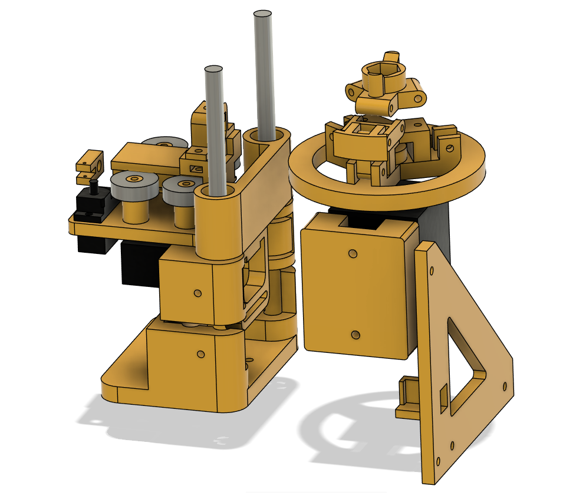

# Tape printer

Reinventing the printer - writing on a roll of tape with a sharpie.

## Overview
This project uses `GRBL` to control a stepper motor and two RC servos in a
CNC-machine-with-rotary-axis style. An `Atmega8` MCU is used to map the step/dir
control pulses from `GRBL` into servo commands.


## Printing
This project provides python code to generate GCODE for printing provided 
text string and font name+size.

Run the code in `print.ipynb` notebook:

```console
cd printing_wizard
jupyter notebook
```

The result of the above is a `text.nc` file that can be used in your
GCODE sender app of choice.


## Build

You will need:
* Arduino Nano
* Atmega8
* A4988 driver
* Nema17 motor (for X axis)
* MG996R servo (for Y axis)
* MG90s servo (for Z axis)
* 12-24V / 4A DC power supply
* 5V buck converter (for servo powering)
* 8mm linear rails (2 pcs, ~15cm each)
* 8mm linear bearings (2 pcs, `SCS8UU` part)
* 8mm skateboard bearings (4 pcs)
* M3 screws up to 30mm, nuts, washers, etc.
* A couple of M4 and M8 bolts, a couple of springs


### Flashing `GRBL`
Check out the latest version of `GRBL`.
Use the config file provided in `grbl/config.h` to replace/merge with the `GRBL` one.
Compile and flash on an Arduino Nano.

#### `GRBL` settings
Apply the `GRBL` settings (steps per mm for each axis, etc.)
listed in `grbl/settings.txt` after flashing the firmware.

### Flashing the `stepper-to-servo` firmware
Open the `stepper-to-servo` Arduino project and compile.
Copy the path to the compiled `stepper-to-servo.ino.hex` from the compiler log.

Attach your programmer to the Atmega8 and from the `avrdude` folder, run:
```console
# Set the fuses for 8MHz internal oscillator
.\avrdude.exe -v -patmega8 -cusbasp -Pusb -U lfuse:w:0xd4:m -U hfuse:w:0xd9:m

# Flash the firmware
.\avrdude.exe -v -patmega8 -cusbasp -Pusb -Uflash:w:PATH_TO_arduino_build/stepper-to-servo.ino.hex:i
```

### Schematic / wiring




### 3D Models

All `.stl` files are available in the `stls` directory.


